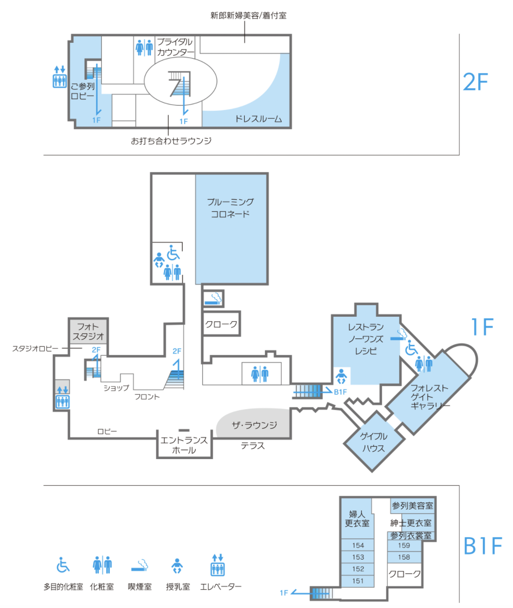
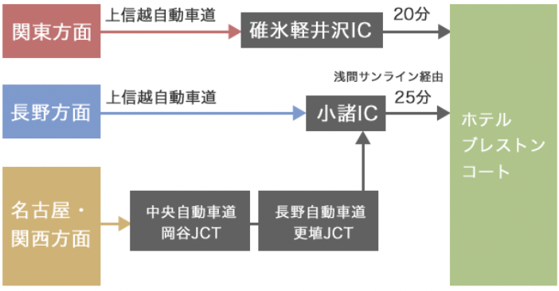
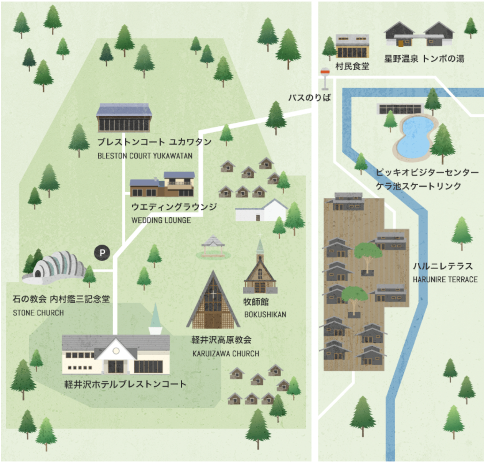

# ご案内
### 集合時間・場所

ご多用中恐れ入りますが、ご臨席承りますようご案内申し上げます。
集合時間：11:00
集合場所：2F ご参列ロビー

### 美容・着付けについて

ホテルにて参列者様のヘアセット・メイクのご用意も可能です。  
「完全予約制」となっておりますので、挙式日の2週間前までに事前のご予約（[0267-46-6200](tel:0267-46-6200)）をお願い致します。

**場所**

ホテルブレストンコート B1F
[ホテル館内MAP参照](#ホテル館内MAP "ホテル館内MAP")

**着付け・ヘア・メイク料金**

| 内容 | 料金（税込） |
|:-----------|:------------|
|留袖着付け|11,000円|
|振袖着付け|14,300円|
|ヘア |7,700円|
|メイク|8,800円|

※お支度入りは挙式の2～3時間前のご案内となります。  
ご利用人数が多い場合、お客様の入室時間が異なりますので、詳細はお電話にてお問い合わせ下さい。

ご自身のお衣裳を事前に発送される場合は、挙式2日前必着で下記の住所までご送付ください。

**送付先**

〒389-0111  
長野県北佐久郡軽井沢町長倉2144  
軽井沢ホテルブレストンコート B1Fクローク参列衣裳係宛  
TEL [0267-46-6200](tel:0267-46-6200)
※お荷物の入った箱の表側（宅急便伝票「品名欄」など）に、挙式日・ご両家名・ご使用者のお名前・品名を明記してください。  
例：6月18日 山上・江口家 ご使用者名：長野 花子 品名：ドレス  

### 更衣室

ホテルB1Fに紳士用・婦人用の更衣室がございます。  
ご自由にご利用ください。

### お手荷物
貴重品以外のお手荷物はホテル1Fのクロークでお預けください。  
更衣室内にも簡易ロッカーの用意がございます。

### ホテル館内MAP

### アクセス

**電車でお越しの場合**

軽井沢駅南口より無料送迎バスが運行しております。  
シーズンや曜日によって時刻が異なりますので、[時刻表](https://www.blestoncourt.com/access/shuttlebus/)をご確認ください。

タクシーをご利用の場合

* 軽井沢駅から約15分（2,500円前後）
* 中軽井沢駅から約10分（1,000円前後）

**お車でお越しの場合**

ホテル専用の駐車場（無料）をご利用ください。  
予約は不要です。

### 軽井沢星野エリアMAP

その他ご不明点は下のリンクをご参照ください。
https://www.blestoncourt.com/wedding/guest/